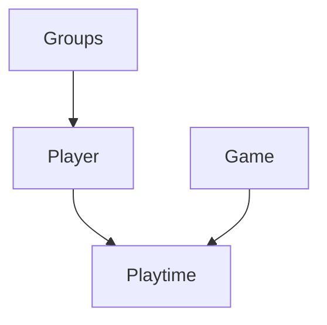
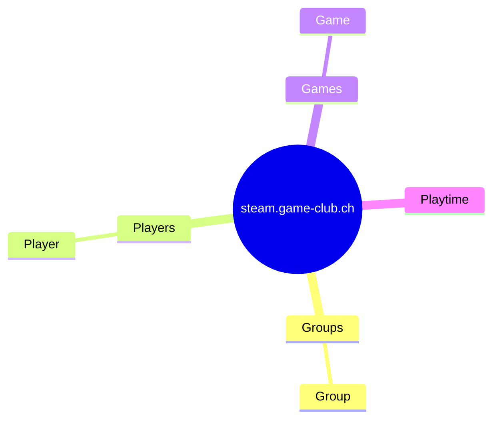

# Doku

## Types
* Groups
* Player
* Game
* Playtime

## Sitemap

## SteamGroups

http://steamcommunity.com/gid/103582791430857185/memberslistxml/?xml=1

## Goal

* Widget integration für Profil und Groupe

## Dokumentation 

https://developer.valvesoftware.com/wiki/Steam_Web_API
https://steamapi.xpaw.me/#ICommunityService/GetApps

### Store Game Details

https://store.steampowered.com/api/appdetails/?appids=3167020&language=de

capsule_image