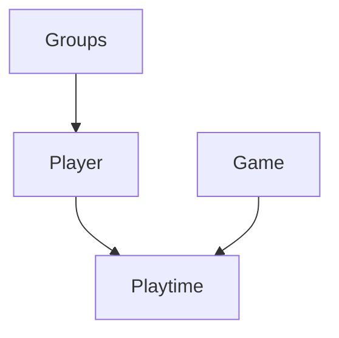
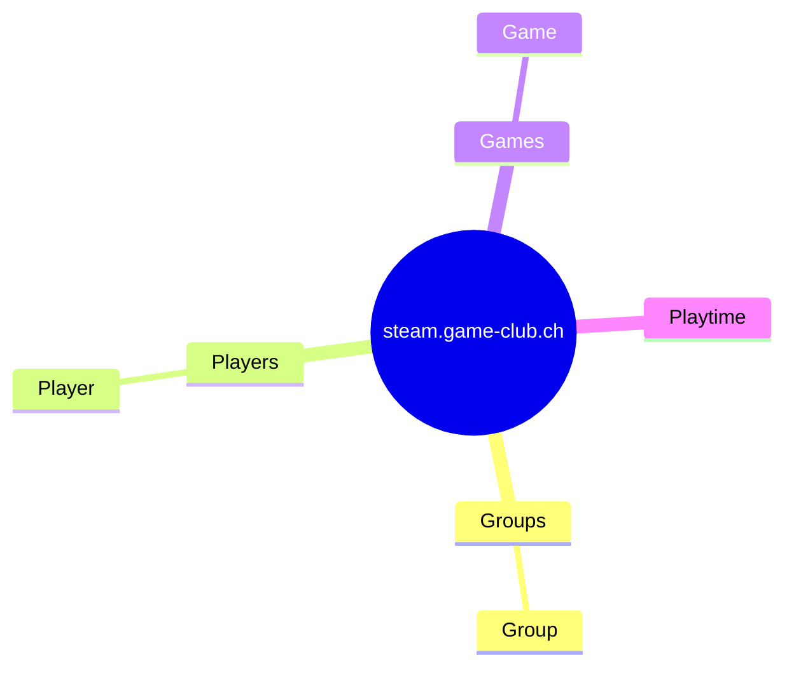

# Doku

## Types
* Groups
* Player
* Game
* Playtime

## Sitemap

## SteamGroups

http://steamcommunity.com/gid/103582791430857185/memberslistxml/?xml=1

## Goal

* Widget integration für Profil und Groupe
